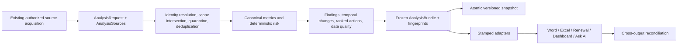

# AdoptIQ Decision Intelligence V2 — Engineering and Evaluation Report

- **Report date:** 2026-07-13
- **Implementation status:** Engineering candidate; synthetic, focused, active-path, and mapped offline verification complete
- **Analysis schema:** `2.0.0`
- **Engine identifier:** `decision-intelligence-v2`

> **Release-status notice:** The 20-scenario Decision Intelligence evaluation is green at **200/200 assertions**, and every listed migrated report boundary now has focused synthetic verification. This remains an engineering result, not a claim of predictive accuracy, production calibration, or authorized enterprise-environment readiness. The final independently snapshotted repository-wide offline diagnostic collected **6,575** tests: **6,514 passed, 11 skipped, 6 deselected, 21 failed, and 23 errored**. All 21 failures reproduce at baseline: 20 are legacy non-artifact failures, while the remaining failure and all 23 errors require absent Round 56/57 historical artifacts. Focused and repository-wide results are kept separate in Section 12.

## Executive summary

AdoptIQ already had substantial deterministic customer-success logic, canonical metric helpers, source-aware risk scoring, grounded Ask AI validation, and mature report-generation paths. Its principal logic risk was not the absence of calculators; it was that multiple paths could independently fetch, normalize, aggregate, score, narrate, and render the same request. That allowed equally scoped outputs to agree on a headline while differing in evidence coverage, history semantics, or the calculations used to reach it.

Decision Intelligence V2 introduces one request-scoped analytical contract:

- `AnalysisRequest` expresses the authorized customer, account, subscription, team, leader, technology, renewal, source, and time boundaries.
- `build_analysis_bundle()` performs strict identity partitioning, conflict quarantine, deterministic deduplication, metric calculation, risk evaluation, cross-source findings, temporal comparison, action ranking, and portfolio aggregation once.
- The resulting frozen `AnalysisBundle` carries canonical facts, evidence references, uncertainty, diagnostics, and deterministic fingerprints.
- Local versioned snapshots provide a comparable prior state without reparsing generated Excel artifacts.
- Thin adapters project the same bundle to Word, Excel, renewal, a synthetic dashboard reconciliation shape, and Ask AI, stamping each projection with a reconciliation manifest. Active dashboard migration currently covers report-history/provenance identity rather than every live dashboard fact.
- Grounded Ask AI treats the adapter projection—not model text—as the authority for metrics, findings, and actions.

The fixed synthetic evaluation covers 20 adversarial scenarios and records 200 individually identified assertions: **200 passed and 0 failed**. A five-surface adapter reconciliation also completed with zero reconciliation errors and unchanged input frames. These are meaningful correctness results, but they do not establish real-world calibration, causal validity, or outcome lift.

The cost is measurable, but request-scoped canonical-frame reuse materially improved it. Before that optimization, an isolated 100-customer V2 build observed **29.539396 seconds**. In the final correctness-hardened controlled benchmark, the 100-customer median was **14.127626 seconds**, versus **25.746506 seconds** with reuse disabled in the earlier same-shape harness. That is a **45.1%** reduction while fingerprints, reconciliation, and input immutability remained unchanged. This does not establish a service-level objective: the recorded pre-V2 100-customer full Compact path was **11.054 seconds**, the workloads are not identical, and Word projection still dominated adapter cost.

## 1. Scope, evidence, and interpretation rules

This report is based only on the working source tree, existing tests, existing fixtures, explicitly synthetic scenarios, and recorded local measurements. No customer data, production credentials, private Cisco services, Snowflake production environment, CSOne, CSConsole, or new network connector was used.

The protected source copy finished with **1,191 regular files** and the exact pre-change SHA-256 tree-manifest digest `7227f8b2ae33416aab410238db51a9a7dbc92354ed834c2aad0ca4e979c2b5dc`. Five runtime-only pytest/cache artifacts discovered during final verification were removed from the protected copy; excluding those artifacts already reproduced the recorded digest, and the final all-files digest now reproduces it exactly. No source file in that copy was changed.

The local verification runtime used Python **3.12.13** on **macOS 15.7.8 arm64**. Performance observations are wall-clock measurements from that local environment; they are not service-level objectives or portable capacity claims.

The status terms in this report have narrow meanings:

- **Implemented:** code is present in the active path.
- **Focused verified:** a directly relevant deterministic unit or integration test passed.
- **Reconciled:** stamped projections were proven to have the same fingerprint, customer universe, canonical metrics, payload digest, and permitted evidence set.
- **Pending verification:** code may exist, but the end-to-end path has not yet met the evidence bar for this report.
- **Not validated:** would require authorized data, live systems, or a completed broad-suite run.

## 2. Recorded pre-V2 baseline

### 2.1 Test baseline

Before the V2 logic changes, the recorded repository baseline was:

| Result | Count |
|---|---:|
| Passed | 1,238 |
| Skipped | 3 |
| Reported failures | 0 |

This is the pre-change comparison floor, not the final result after adding V2 code and tests.

### 2.2 Calculator drift and duplicated work

The audit found multiple independent truth-building paths:

| Path | Recorded pre-V2 behavior | Decision risk |
|---|---|---|
| Compact | Recalculated portfolio facts approximately 3–5 times in one request. | Later calculations could drift from earlier narrative or export values. |
| Renewal | Performed at least five aggregate/calculator passes. | Renewal views could diverge from portfolio metrics derived from the same frames. |
| Subscription | Fetched the same request scope twice. | Duplicate I/O could observe different source moments and increased latency/failure exposure. |
| Leader | Fetched subscriptions twice and generated Word content twice. | Team slices and final narrative could be produced from different intermediate state. |
| Comprehensive | A second artifact hard-coded health band `B`. | The artifact could contradict the calculated customer health. |
| Ask AI | Independently rebuilt its own version of canonical truth. | Model grounding could differ from report/export calculations even when the headline matched. |
| History | Zero or one historical snapshots returned `{}`; comparison reparsed XLSX and had no versioned schema/scope contract. | “No change” and “not comparable” were indistinguishable, and artifact layout could affect history logic. |

The most concrete parity observation was a report and Ask AI headline that matched while their evidence coverage differed: **1.00 versus 0.92**. The numbers did not expose the discrepancy; only the independently rebuilt evidence state did.

Pre-V2 actions also lacked a complete decision contract. They did not consistently have stable action IDs, record-level evidence links, structured ranking factors, dependencies, expected outcomes, and measurable success signals.

### 2.3 Recorded pre-V2 performance

| Workload | Recorded observation |
|---|---:|
| One severe synthetic customer, full Compact path | Median approximately **99.933 ms** |
| 100-customer full Compact path | Median **11.054 s** |
| 100-customer observed range | **9.046–13.73 s** |

These numbers establish a latency baseline. They do not show whether every repeated calculation produced a different value; they show the amount of duplicated work and the opportunity for divergence.

## 3. Architecture

The V2 core deliberately has no connector code. Each active caller first obtains and scopes the source frames it is already authorized to use. The core then narrows and partitions those frames again against an explicit request.

### 3.1 Major components

| Component | Responsibility |
|---|---|
| [`decision_intelligence.py`](decision_intelligence.py) | Versioned request, evidence, metric, finding, change, action, customer, portfolio, diagnostics, bundle, builder, and snapshot contracts. |
| [`decision_intelligence_adapters.py`](decision_intelligence_adapters.py) | Backward-compatible risk/metric shapes, Decision Brief Word and Excel projections, bounded Ask projection, manifests, and five-surface reconciliation. |
| [`data_normalization.py`](data_normalization.py) | Conservative ownership identity, alias resolution, ambiguous mapping handling, and cross-customer logical-ID quarantine. |
| [`adoptiq_backend.py`](adoptiq_backend.py) | Existing source acquisition plus preservation of same-ID/different-owner variants until canonical quarantine. |
| [`decision_intelligence_eval.py`](decision_intelligence_eval.py) | Fixed offline synthetic scenario catalogue, exact assertions, deterministic evaluation fingerprint, and per-scenario timing observations. |
| [`app_simple.py`](app_simple.py) | Compact, Renewal, Subscription, Comprehensive, and WxCC request boundaries; source-state preservation; history persistence; compatibility fallback; Word/Excel/status metadata handoff. |
| [`leader_report_generator.py`](leader_report_generator.py) | One leader-scoped bundle before member slicing, plus Word/Excel/risk projections. |
| [`ask_ai_grounded.py`](ask_ai_grounded.py) | Bundle-scoped grounded Ask projection, evidence whitelist, canonical-answer enforcement, and deterministic AI-unavailable fallback. |
| [`enhanced_admin_dashboard_v2.py`](enhanced_admin_dashboard_v2.py) | Additive report-history fields that bind a completion record to schema, fingerprints, comparison scope, and snapshot path. |
| [`wxcc_health_input_exporter.py`](wxcc_health_input_exporter.py) | One WxCC-scoped V2 build, combined TAC-source deduplication, snapshot reuse, adapter risk, explicit fallback, and artifact/status metadata handoff. |

## 4. Immutable request, bundle, and snapshot design

### 4.1 Explicit request scope

`AnalysisRequest` is a frozen dataclass. It rejects a request with no explicit tenant, organization, customer, account, subscription, portfolio, team, leader, technology, or renewal scope. Empty scope fields therefore do not silently mean “all customers.” The contract also records:

- observation window and `as_of_time` in UTC;
- allowed source types;
- report mode;
- comparison snapshot reference;
- immutable feature configuration;
- schema version.

The request has two SHA-256 identities:

- `request_fingerprint` includes the full request, including the current observation time and presentation mode;
- `comparison_scope_fingerprint` removes advancing window endpoints, `as_of_time`, comparison pointer, and report mode so two observations of the same factual entity scope can be compared across report formats.

Account, subscription, technology, and team/leader restrictions are conjunctive when the subscription roster exposes the corresponding columns. Missing optional scope columns produce an explicit warning rather than an unreported widening.

Source identity is also conjunctive. Only genuine scalar strings can authorize customer, account, subscription, renewal, team, or leader scope. Every populated customer alias must resolve to one conservative owner; every populated account alias must belong to one account-equivalence class; and customer labels must agree with account ownership. The account lookup uses the same full-token case-insensitive rule for generic IDs and checksum-aware, case-sensitive Salesforce 15/18 equivalence as request matching. If equivalent account forms assert different owners, that entire account class is ambiguous and account-only scope fails closed.

Comprehensive Snowflake Action Plan owner-email filters expand candidate acquisition only. Technology input is allowlisted at the request boundary and rejected/fails closed when unsupported. Before bundle construction, every nonblank supported account alias on each returned row must resolve inside the selected account roster, including safe Salesforce 15/18-character equivalence; conflicting, out-of-scope, or blank-account rows are omitted with explicit diagnostics, while an unverifiable account schema fails closed as partial/unavailable rather than observed empty. For a named technology, every populated technology/product alias must agree with the request; contradictions, compound cross-product attribution, non-scalar cells, and rows without explicit technology evidence are excluded with machine-visible diagnostics. Account membership alone never proves Action Plan technology scope.

### 4.2 Identity, deduplication, and evidence

The canonical boundary applies these rules before scoring:

1. Normalize duplicate physical schema labels before any Series-based reader runs. Blank-plus-value and semantically agreeing duplicates coalesce under a deterministic canonical label; contradictory rows are quarantined with customer/account-attributed `duplicate_schema_conflicts` diagnostics. Numeric and datetime fields use column-aware equivalence, while identifiers preserve meaningful distinctions such as leading zeros.
2. Prefer explicit source ownership.
3. Fill ownership only from an unambiguous account/subscription lookup.
4. Preserve configured aliases while keeping conservative ownership identities distinct; legal suffixes such as `Inc` and `LLC` are not stripped at the ownership boundary.
5. Preserve same-ID/different-owner rows through transport so the core can see the conflict.
6. Quarantine every logical identifier observed under more than one resolved customer; do not assign it alphabetically or count it for either customer.
7. Deduplicate TAC cases, Customer Pulse records, and Action Plans using shared canonical helpers; other sources use a deterministic latest-timestamp/signature rule.
8. Retain null-ID rows with a deterministic derived row identifier keyed by canonical schema labels rather than physical header formatting, so benign case/spacing variants do not change factual identity.

Repeated metric projections may reuse a marked canonical TAC, Pulse, or Action Plan frame, but the marker is only a hint. The helper re-coalesces the current logical IDs and accepts the fast path only when every usable ID is still unique. This closes pandas `attrs` propagation hazards: same-length mutation, duplicated marked subsets, and WxCC cross-source overlap all recanonicalize. If a source-specific canonicalizer itself fails, bundle construction fails visibly; V2 never silently substitutes a generic dedupe while still claiming canonical status.

Every source contributes record-level `EvidenceReference` objects plus a source-state reference. An evidence reference records the stable source identifier, customer and subscription identity, field, observed value, observation and ingestion times, freshness, authority, scope, conflict status, bounded excerpt, and provenance. The bundle distinguishes `missing`, `fetch_failed`, `observed_empty`, `available`, `conflict_only`, and `excluded_by_request`; unavailable evidence is never interpreted as an observed zero.

### 4.3 Canonical bundle

`AnalysisBundle` contains:

- the original request and resolved analysis context;
- ordered `CustomerAnalysis` objects;
- one `PortfolioAnalysis` roll-up;
- ordered evidence references;
- explicit diagnostics for missing, stale, contradictory, quarantined, skipped, degraded, and failed sources.

Nested mappings are recursively frozen with `FrozenDict`; sequences are normalized to tuples; dataclasses are frozen; customer, evidence, metric, finding, change, and action ordering is deterministic. `AnalysisBundle.__post_init__()` rejects internal reconciliation errors.

The `analysis_fingerprint` is calculated from a canonical payload containing structured metrics, findings, temporal changes, actions, evidence, request, portfolio state, and diagnostics. Volatile generation time, ingestion timestamp, and prose fields are excluded from factual identity. The builder recomputes the digest after final construction and fails if self-verification changes it.

### 4.4 Versioned local snapshots

`AnalysisSnapshotStore` persists the bounded bundle, not source DataFrames, connector credentials, or process-local state. Writes are JSON, sorted, `fsync`-backed, atomic `os.replace` operations. Directories are best-effort mode `0700`; files are best-effort mode `0600`.

Snapshots are partitioned by comparison-scope fingerprint and named with the `as_of_time` and analysis digest. A `_latest.json` manifest records schema, request, scope, analysis fingerprint, and times. Loading verifies:

- bundle reconciliation;
- canonical-payload fingerprint;
- matching comparison scope;
- compatible major schema version.

An absent, corrupt, cross-scope, or incompatible snapshot yields a visible `not_comparable` condition; it does not manufacture a trend. Report-history storage was migrated additively so legacy rows remain readable as `legacy_unversioned`, while V2 rows can be marked comparison-eligible without copying source content into SQLite.

## 5. Analytical semantics

### 5.1 Metrics, risk, findings, and uncertainty

V2 retains the established deterministic risk engine in `risk_scoring.compute_customer_risk_profile`, but invokes it after one strict request-scoped partition and stores its result in the canonical bundle. Shared canonical metric helpers calculate barriers, TAC/P1/P2/BEMS, break-fix/provisioning, Pulse, Action Plans, subscriptions, and renewal proximity. Portfolio values are sums or distributions of the frozen customer results rather than independent re-queries.

Structured findings label the nature of a conclusion. Supported kinds include observed fact, deterministic calculation, relationship, inferred explanation, risk signal, opportunity signal, temporal change, conditional scenario, recommendation, and data quality. Current implementation uses deterministic calculations, risk/opportunity signals, relationships, scenarios, and data-quality findings; it does not promote model prose to a fact.

Examples of conservative semantics include:

- negative Pulse plus active escalated service evidence is described as a coincident relationship that warrants a coordinated review, explicitly **not** proof of causation;
- missing or conflicted evidence can make canonical risk `UNKNOWN` rather than healthy;
- severe active P1/BEMS evidence establishes a conservative risk/action floor;
- source freshness and evidence coverage reduce confidence and are reported separately from the risk value;
- a future state is represented only as a conditional scenario with `probability: null`, not a fabricated probability.

### 5.2 Temporal and change semantics

Temporal comparison is permitted only when the prior snapshot has the same comparison-scope fingerprint and compatible schema major version. Current rules cover:

- `new`, `worsening`, `improving`, `persistent`, `recovering`, `resolved`, `uncertain`, and `not_comparable` states;
- risk-score movement of at least 5 points or any risk-band transition;
- changes in critical/high barriers, overdue Action Plans, P1, and BEMS counts;
- Pulse movement of at least one point on the canonical 0–10 scale;
- entry into the configured renewal-attention window;
- evidence-coverage change of at least 0.10;
- new or resolved ownership conflicts;
- new, resolved, or persistent material findings.

With no compatible prior snapshot, current state remains usable but trend is `not_comparable`. A customer newly entering an otherwise comparable scope is labeled `new`, separating membership change from performance change.

The contract has fields for age, persistence, recurrence, momentum, acceleration, and time since meaningful evidence. Current rules populate only the supported subset. Acceleration is currently `not_comparable`, and the engine does not yet emit a calibrated recurrence count or probability forecast. Those are deliberate limitations, not hidden zeros.

### 5.3 Next-best actions

Actions now have stable IDs derived from customer identity and action type, a triggering finding chain, record-level evidence IDs, proposed owner role and owner-confidence label, urgency, rank, priority score, factor breakdown, dependencies, expected outcome, measurable success signal, timing window, effort, confidence, and lifecycle state.

The deterministic priority score is:

| Factor | Weight |
|---|---:|
| Customer impact / finding importance | 34% |
| Urgency | 20% |
| Persistence or momentum | 14% |
| Renewal proximity | 10% |
| Source freshness | 7% |
| Confidence | 7% |
| Actionability | 5% |
| Effort | 3% |

Additional guardrails are material:

- low-confidence remediation is capped at 64 unless the action establishes evidence, resolves ownership, or addresses severe service evidence;
- evidence-establishment actions have a floor of 78;
- severe service actions have a floor of 90;
- action confidence cannot exceed the customer’s data-quality confidence;
- an action with dependencies cannot claim an immediate timing window;
- recommendations do not invent calendar dates;
- named owners are not fabricated; the output identifies a role and whether ownership is inferred or source-qualified.

## 6. Five-surface projection and reconciliation

Adapters preserve existing consumer shapes while preventing a second truth calculation. Every stamped projection contains a `_decision_intelligence` manifest with:

- manifest and analysis schema versions;
- projection kind;
- analysis and request fingerprints;
- full bundle and projected customer IDs;
- projected evidence IDs;
- canonical metrics and their digest;
- a payload digest.

`validate_cross_output_reconciliation()` requires these five surfaces by default:

1. `report` — the exact content model rendered into Word;
2. `export` — Decision Brief Excel frames;
3. `renewal` — renewal compatibility projection;
4. `dashboard` — dashboard compatibility projection;
5. `ask_ai` — bounded, evidence-whitelisted Ask projection.

Validation rejects missing manifests, wrong projection kinds, schema/fingerprint mismatches, customer-universe escape, canonical metric drift, post-projection mutation, unknown or cross-customer evidence, mismatched legacy risk profiles, and Ask citations outside its evidence whitelist.

The recorded five-surface synthetic run:

- passed reconciliation;
- produced **zero reconciliation errors**;
- left input frames unchanged;
- detected deliberate post-projection drift in the negative test.

This proves adapter-level provenance and factual parity for the tested bundle. It does **not** yet prove that every cell and paragraph in every legacy live artifact is bundle-derived; the active-path status below is the narrower production claim.

## 7. Active integration status

| Surface/path | Current status | Evidence and boundary |
|---|---|---|
| Compact report | Implemented; focused verified | Builds one V2 bundle after authorized frames are present and before report-local risk work; adapter risk/portfolio/Word/Excel projections are reused. |
| Renewal single/portfolio | Implemented; focused verified | Builds once before per-customer/portfolio risk work; preserves renewal compatibility fields and Decision Brief outputs. |
| Subscription analysis | Implemented; focused source-shape/compatibility verified | Reuses the one authorized fetch and avoids the historical second subscription-risk fetch on canonical success. |
| Leader report | Implemented; focused verified | Builds one leader/team-scoped bundle before direct-report slicing; Word and Excel reuse that bundle. |
| Grounded portfolio Ask AI | Implemented; focused and selected regressions verified | Builds once or validates an optional prebuilt bundle with exact customer/account/subscription/technology/leader scope, then uses only `ask_ai_safe_projection`. |
| Admin report history | Implemented; focused verified | Additively records schema, request/scope/analysis fingerprints, and snapshot path; legacy database rows migrate in place. |
| Comprehensive report | Implemented; focused and mapped verified | Finalizes scoped CSConsole/Snowflake sources, builds once before customer/risk/portfolio facts, reuses adapter risk/portfolio/Word/Excel, stamps history, and invokes legacy scoring only on visible V2 failure. Technology input is allowlisted; owner-email acquisition is intersected with every account alias and all available explicit technology aliases, while conflicts and unverifiable account identity fail closed. Focused V2 app tests passed 16/16; the mapped Comprehensive subset passed 99/99 before the final hardening additions, and the final AP delta matrix passed 77/77. |
| WxCC health input/export | Implemented; focused and mapped verified | Combines CSOne and Snowflake TAC evidence, builds once, reuses a compatible prior snapshot, projects adapter risk, carries fingerprint metadata through the export result and job status, and exposes legacy fallback. The exact WxCC matrix passed 49/49; the final focused V2 WxCC module passed 7/7. |

The five-surface synthetic “dashboard” projection should not be confused with a claim that every live dashboard metric has been migrated. Current dashboard work establishes history/provenance metadata; full live dashboard factual migration remains part of the follow-on audit.

## 8. Grounded Ask AI

The active portfolio Ask path now waits until the authorized roster, adoption barriers, support cases, Customer Pulse, Action Plans, Success Priorities, incidents, and explicit account/customer/subscription/team/leader/technology/time scope are available. Portfolios wider than the configured account-query cap are fetched in bounded batches for every canonical row source; a missing batch becomes `fetch_failed`, never an authoritative zero. The path then either:

- invokes `build_analysis_bundle()` exactly once; or
- accepts a keyword-only optional `analysis_bundle` and rejects it unless customers, accounts, subscriptions, technology, and leader/manager scope exactly match the active request. Exact account comparison preserves valid Salesforce 15/18 equivalence, while an empty authorized subscription set cannot admit a bundle carrying subscriptions.

`decision_intelligence_adapters.ask_ai_safe_projection()` is the sole authoritative payload for metrics, findings, and actions. The prompt contains a bounded structured projection and adapter-whitelisted evidence only. User questions and source excerpts are fenced as untrusted data. Corpus citations are disabled in this bundle-scoped path because every admitted citation must belong to the active bundle.

The model may summarize supported findings, but it cannot change canonical behavior:

- canonical metrics are prepended to the answer;
- existing numeric and relationship validators still run;
- model-authored actions are discarded and canonical ranked actions are appended;
- unsupported/cross-scope evidence cannot enter the citation whitelist, and deterministic finding/action citations are intersected with evidence records actually rendered into the current prompt/index;
- schema, analysis, request, and scope fingerprints plus actual/projected evidence whitelists are included in diagnostics;
- the diagnostics are nested in the existing `retrieval_diag` so unchanged synchronous JSON and SSE wrappers preserve them;
- AI failure returns a deterministic canonical answer rather than changing facts;
- V2 construction failure alone enters the explicit legacy compatibility path and emits a warning.

The safe projection is bounded to 500 customers and an environment-configurable evidence cap clamped to 1–1,000 records. External incidents are supported by `AnalysisSources`; bug and maintenance feeds are not presently members of the canonical source contract and therefore cannot be cited by V2 Ask.

## 9. Synthetic evaluation

### 9.1 Scenario catalogue

The fixed catalogue covers:

| Theme | Scenarios |
|---|---|
| Normal and severe state | `healthy_current`, `active_p1_bems`, `concentrated_risk_portfolio`, `broad_low_confidence_portfolio` |
| Temporal movement | `worsening_pulse`, `improving_risk`, `recurring_issue`, `no_prior_snapshot`, `schema_transition` |
| Adoption, action, renewal, opportunity | `barrier_without_action_plan`, `overdue_action_plan`, `approaching_renewal`, `verified_opportunity` |
| Evidence quality and contradiction | `stale_evidence`, `ownership_conflict`, `cross_source_contradiction`, `similar_legal_names`, `cross_customer_contamination` |
| AI safety/resilience | `prompt_injection_text`, `ai_unavailable` |

Each scenario runs nine common invariants:

1. bundle reconciliation;
2. portfolio/customer total parity;
3. customer evidence isolation;
4. evidence-linked material findings;
5. complete action → finding → evidence chains;
6. deterministic non-increasing action ranking;
7. date/dependency guardrails;
8. lossless serialization round-trip;
9. safe-projection parity.

Each also runs one scenario-specific assertion, producing exactly 10 assertions per scenario and 200 overall.

### 9.2 Results

| Measure | Result |
|---|---:|
| Scenarios | 20 |
| Assertions | 200 |
| Passed | 200 |
| Failed | 0 |
| Focused pytest module | 9 passed |
| Evaluation schema | `decision-intelligence-eval-v1` |
| Deterministic evaluation fingerprint | `evaluation:b3e010b4cf84e45216e3efedbd971fc32fe23b223d900aa16640d4201509d3c1` |

The focused module was re-run against the current working tree on 2026-07-13: `tests/test_decision_intelligence_evaluation.py` completed **9 passed**.

The result validates deterministic contract behavior on synthetic inputs. It does not validate threshold calibration against real renewals, predict escalation probability, measure recommendation acceptance, prove causal explanations, or establish business outcome improvement.

## 10. Performance observations

### 10.1 V2 measurements

| Workload | Observation |
|---|---:|
| One-customer hardened canonical build | Median **0.160247 s**; range **0.098705–0.230352 s** across 5 builds |
| 10-customer hardened canonical build | Median **1.464267 s**; range **1.114794–1.609665 s** across 3 builds |
| 100-customer hardened canonical build | Median **14.127626 s**; range **11.743249–14.337296 s** across 3 builds |
| 100-customer earlier cache-disabled simulation | Median **25.746506 s** |
| Earlier 100-customer isolated observation before reuse | **29.539396 s** |
| Earlier 100-customer observation under concurrent contention | **45.375002 s** |
| Five-surface adapter/reconciliation work | **8.709731 s** total |
| Word projection within adapter work | **7.442612 s** |
| Peak resident memory | **106.562 MiB** |
| Bundle reconciliation errors | **0** |
| Input mutation detected | **No** |

### 10.2 Interpretation

The final hardened V2 builder remains slower than the recorded pre-V2 Compact benchmark in this local observation, but that comparison is directionally useful rather than like-for-like: V2 creates record evidence, data-quality state, cross-source findings, temporal change objects, ranked actions, decision briefs, immutable payloads, and reconciliation fingerprints, while the old Compact timing covers a different orchestration path. No cross-workload latency improvement claim is made.

Canonical-frame reuse validates the current logical-ID uniqueness invariant before accepting a marked TAC, Pulse, or Action Plan frame. It therefore does not trust pandas-propagated attributes: same-length ID mutation, subset-then-concat duplication, and the reproduced WxCC cross-source overlap all force recanonicalization. This hardening costs approximately 1.84–1.91× versus the rejected unsafe fast path, but the 100-customer median remains 45.1% below the earlier no-cache simulation. The adapter measurement identifies Word rendering as the dominant remaining adapter cost: 7.442612 of 8.709731 seconds. The next optimization target is projection/render efficiency and avoiding repeated document traversal, not weakening reconciliation or evidence checks.

The final benchmark used Python 3.12.13 and pandas 2.2.3, fixed timestamps, one warm-up per size, `gc.collect()` outside the timer, and synthetic per-customer inputs of one subscription, two barriers, six raw/three logical TAC cases, four raw/two logical Pulse records, four raw/two logical Action Plans, and one Success Priority. Measurements remain observational: there is no committed cross-platform performance gate or service-level threshold.

## 11. Compatibility and resilience

V2 is additive at established boundaries:

- existing connector acquisition remains outside the core;
- no network service or package dependency was added for canonical analysis;
- legacy risk profiles retain both 0–10 and 0–100 scales and existing band/color/category aliases;
- existing report modes and legacy output labels remain available;
- Decision Brief sheets and Report Info fingerprint rows are additive;
- the grounded Ask function keeps its positional request argument and adds only a keyword-only optional bundle;
- existing Ask JSON/SSE fields remain, with V2 diagnostics added under a preserved diagnostics field;
- report-history schema migration adds nullable fields and preserves legacy rows;
- snapshot schema-major checks prevent invalid temporal comparisons;
- canonical build failure is visible and only then permits legacy compatibility calculation;
- AI synthesis failure does not widen scope or change canonical facts;
- tests verify that source DataFrames remain unchanged by V2 analysis.

This design intentionally preserves legacy fallback code for continuity. It does not claim that every legacy calculator can be deleted yet; deletion is safe only after all active paths are verified to consume the same bundle.

## 12. Validation record

| Validation | Recorded result | Scope |
|---|---:|---|
| Pre-V2 selected baseline matrix | 1,238 passed / 3 skipped | Comparison floor before V2; not the full repository suite |
| Synthetic evaluation pytest | 9 passed | Current evaluation module |
| Synthetic invariant ledger | 200 passed / 0 failed | 20 fixed scenarios |
| Final complete V2 test glob | **127 passed** | All `tests/test_decision_intelligence_*.py` modules, including current duplicate-schema, strict-scope, identity-alias, account-equivalence, and ID-less fingerprint regressions |
| Mapped integration/source-guard matrix before final AP scope deltas | **242 passed** | 25 active-path and compatibility modules |
| Final Comprehensive AP delta matrix | **77 passed** | V2 app plus AP sheet/provenance/parity modules |
| Expanded AP/Comprehensive regression matrix | **118 passed** | Additional Action Plan summary/scope/Leader/curation compatibility modules plus the final strict backend scope regression |
| Ask V2 focused integration | 12 passed | Batching, exact bundle scope, grounding, injection, citation closure, fallback |
| Comprehensive V2 app integration | 16 passed | One boundary, source state, history, AP merge/failure, account and explicit-technology scope, Word/Excel identity |
| WxCC focused V2 module | 7 passed | One build, snapshot reuse, source merge, fallback, metadata, forged-marker regression |
| Exact WxCC compatibility matrix | 49 passed | Existing WxCC report/export behavior |
| Source preservation | 9 passed | Raw ownership variants and ambiguous resolution |
| Focused duplicate physical-schema regression | Passed | Identical/blank coalescing, conflicting identity/scope/technology/metric quarantine, leading-zero identifier preservation, Comprehensive/public-ingress merging, and source-concatenation safety |
| Offline Ask evaluation marker | 6 passed | Explicitly synthetic/offline evaluation runner |
| Five-surface reconciliation | Passed; 0 errors | Synthetic adapter projections |
| Full repository diagnostic | 6,514 passed / 11 skipped / 6 deselected / 21 failed / 23 errors | 6,575 collected; 104.55 s independently snapshotted pytest time |
| Compile/Ruff/diff checks | Clean | All changed/new Python plus whitespace validation |

The final full diagnostic was triaged rather than summarized as a simple red/green result:

- all 20 legacy non-artifact failures reproduce exactly against clean baseline commit `842d5b9`;
- seven earlier failures were hard-coded `/Users/jestory/...` paths and were fixed to derive the repository root;
- one obsolete test asserted the removed legacy Subscription source shape and was replaced with a stricter V2 one-build/fetch-once/guarded-fallback assertion;
- the grounded-answer seam preserves its established four positional-or-keyword arguments, including optional relationship evidence; its strengthened compatibility contract passes;
- the remaining failure and all 23 fixture errors also reproduce at baseline and require Round 56/57 historical manifest/artifact files that are absent from this repository;
- the optional `hvac`, Snowflake, and `feedparser` imports were supplied only as inert in-memory test stubs; no installation or connection was attempted.

After those actionable fixes and the final source-state, scope, physical-schema, and account-equivalence hardening, the complete V2 glob and final AP matrices passed with zero failures or skips. The 242-test mapped aggregate predates the final AP scope-only additions, whose affected modules are covered by the final 77- and 118-test matrices. The repository-wide aggregate above is a direct final run, not an inference.

## 13. Limitations and unresolved risks

1. **No authorized real-world calibration.** Synthetic tests prove logic invariants, not whether thresholds optimally predict churn, escalation, adoption, or renewal outcomes.
2. **Artifact/environment acceptance remains open.** Active paths are focused/mapped verified, but representative artifacts were not generated against authorized enterprise data or visually accepted in a frozen macOS/Windows build. Live dashboard factual migration is also narrower than the five-surface adapter proof.
3. **Performance cost.** The final 100-customer median was 14.127626 seconds versus the non-equivalent 11.054-second pre-V2 Compact observation; Word rendering dominates adapter time.
4. **Two-point temporal model.** Current change logic compares the current bundle with one compatible prior bundle. It is not a multi-period time-series model.
5. **No calibrated probability.** Conditional scenarios intentionally carry no probability. Acceleration and recurrence fields are not yet fully derived.
6. **Rule calibration.** Risk thresholds and action-score weights are deterministic and testable, but still require authorized product/domain-owner validation.
7. **Role-level ownership.** Recommended owners are roles unless source evidence qualifies an owner; V2 does not assign a named person without authority.
8. **Canonical source coverage.** The core covers subscriptions, Adoption Barriers, support cases, Customer Pulse, Action Plans, Success Priorities, and external incidents. Bugs, maintenance, help content, and locally indexed corpus material are not canonical bundle sources today.
9. **Snapshot protection.** Snapshots are bounded and permission-restricted, but they are not application-level encrypted. They can contain observed canonical values and bounded safe excerpts.
10. **Legacy coexistence.** Compatibility calculators remain reachable on explicit V2 failure, and some non-migrated legacy sections may still do independent work even when migrated facts are canonical.
11. **Benchmark maturity.** Current timing evidence is local and observational, without committed performance gates or cross-platform baselines.
12. **Repository debt remains visible.** The full diagnostic still contains 20 legacy non-artifact failures plus one failure and 23 errors caused by absent historical artifacts; every non-green node reproduces at baseline, but focused green results are not represented as a fully green repository.
13. **Ask temporal history.** Ask-built bundles currently pass `prior_bundle=None`; temporal comparison in Ask requires a validated supplied bundle or a future request-scoped snapshot lookup.
14. **Snowflake Action Plan technology attribution.** Named-technology requests fail closed when the AP view omits explicit technology/product attribution. Recovering that excluded coverage requires source enrichment or an authoritative AP-to-subscription relationship; account membership alone is not treated as product evidence.

## 14. Next highest-value step

The highest-value next step is **authorized calibration and artifact acceptance**:

1. generate representative Compact, Renewal, Subscription, Leader, Comprehensive, and WxCC artifacts in an authorized environment and reconcile visible totals, fingerprints, evidence IDs, headings/sheets, warnings, and history rows;
2. compare risk bands, temporal labels, and action ranks with de-identified historical outcomes and structured customer-success review;
3. measure discrimination, dangerous under-detection, false urgency, ranking usefulness, and calibration by horizon and evidence-coverage band before tuning documented thresholds;
4. extend Ask to load a compatible request-scoped prior snapshot and complete live-dashboard migration from adapter projections;
5. optimize Word projection/document traversal and establish a committed 1/10/100-customer performance gate;
6. restore the missing Round 56/57 test artifacts and disposition the 21 baseline-reproducible legacy failures without weakening assertions.

Calibration should change deterministic policy only when evidence shows better warning or action ordering; it should not introduce opaque model judgment as the source of truth.

## 15. Principal test and implementation artifacts

- [`tests/test_decision_intelligence_core.py`](tests/test_decision_intelligence_core.py)
- [`tests/test_decision_intelligence_adapters.py`](tests/test_decision_intelligence_adapters.py)
- [`tests/test_decision_intelligence_evaluation.py`](tests/test_decision_intelligence_evaluation.py)
- [`tests/test_decision_intelligence_history.py`](tests/test_decision_intelligence_history.py)
- [`tests/test_decision_intelligence_app_integration.py`](tests/test_decision_intelligence_app_integration.py)
- [`tests/test_decision_intelligence_leader_integration.py`](tests/test_decision_intelligence_leader_integration.py)
- [`tests/test_decision_intelligence_ask_integration.py`](tests/test_decision_intelligence_ask_integration.py)
- [`tests/test_decision_intelligence_source_preservation.py`](tests/test_decision_intelligence_source_preservation.py)
- [`tests/test_decision_intelligence_wxcc_integration.py`](tests/test_decision_intelligence_wxcc_integration.py)

This report is intentionally conservative: it records what the code and tests demonstrate, classifies non-passes, calls out measured cost and unvalidated environments, and does not complete the story with assumptions.
